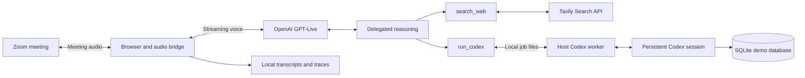

<div align="center">

# Colleague AI

### Bring your coding agent into the conversation.

A voice teammate for Zoom that connects your team to Codex, company data, and web search.

[Get started](#get-started) · [Try a conversation](#try-a-conversation) · [How it works](#how-it-works) · [Roadmap](#roadmap)

**Built for the Agents, Everywhere hackathon · Local-first orchestration · Cloud voice and reasoning**

</div>

---

## From a meeting question to a useful answer

Your team is already talking. Someone needs a sales number, a technical explanation, or current information for a client visit. Colleague AI brings those answers into the call through a voice interface connected to tools.

Give it a Zoom invite from your coding-agent workflow, start the local bridge, and admit **Colleague AI** to the meeting. It listens while muted. When you allow it to speak, it can answer questions, consult a persistent Codex session, and research the web without requiring a wake phrase.

The prototype has been demonstrated in live Zoom calls. It is designed for local development and demos; conversational timing and meeting compatibility are still being improved.

## What you can do

| Capability | Experience |
| --- | --- |
| **Talk with an agent in Zoom** | Meeting audio streams to GPT-Live; replies play through the participant’s virtual microphone. |
| **Bring Codex into the discussion** | Delegate technical analysis and database queries to a read-only Codex session. Select a model for each task. |
| **Keep a technical session going** | Later tool calls resume the Codex session associated with the same meeting URL, including after a worker restart. |
| **Ask about company metrics** | Query a reproducible fictional SQLite dataset covering sales, retention, and churn. |
| **Research current information** | Use a local `search_web` function backed by Tavily and return source-backed answers. |
| **Control participation** | Join muted, continue listening, and accept the host’s Ask to Unmute request automatically. Muting stops outgoing speech. |
| **Review what happened** | Save incremental transcripts, tool events, and generated charts locally. |

Chart rendering works locally. Sending chart attachments to Zoom chat is experimental and has **not** passed an end-to-end delivery test. Automatic screen sharing and post-meeting chat delivery are not implemented.

## Get started

### Prerequisites

- macOS or Linux, with Python 3.10+ and Git. The host worker uses Unix file locking.
- Docker with Docker Compose, running locally.
- An authenticated Codex CLI: run `codex login` and verify with `codex login status`.
- An OpenAI project API key with access to the configured `gpt-live-1` voice model and `gpt-5.6-terra` backend. This prototype depends on those APIs being available to your account.
- A Tavily API key for web search.
- A Zoom meeting that permits the agent to join through the web client.

### 1. Clone and configure

```bash
git clone https://github.com/ankitluthra/colleague-ai.git
cd colleague-ai
cp .env.example .env
cp zoom-live/meeting.env.example .env.zoom
chmod 600 .env .env.zoom
```

Edit `.env` with your own keys:

```dotenv
OPENAI_API_KEY=your_openai_project_key
TAVILY_API_KEY=your_tavily_key
```

Edit `.env.zoom` with your meeting details:

```dotenv
ZOOM_MEETING_URL=https://us05web.zoom.us/j/YOUR_MEETING_ID
ZOOM_PASSCODE=your_meeting_passcode
```

You can use the full Zoom invite URL, including its `pwd` query parameter. Supply the passcode separately if the web client asks for it. Keep these files private; they are ignored by Git.

### 2. Start the agent

```bash
bash start-zoom-live.sh
```

The launcher verifies Codex authentication, builds the Docker images, starts the Zoom browser participant, and runs the Codex worker on the host. The worker creates the demo database automatically. Keep this terminal open for Codex tool calls.

The first build can take several minutes. The shared Joinly base image includes local speech-model dependencies, although the Zoom audio path uses GPT-Live rather than those models.

If the launcher cannot locate Codex, set its executable explicitly:

```bash
CODEX_BIN=/path/to/codex bash start-zoom-live.sh
```

### 3. Admit and unmute

Admit **Colleague AI** if it enters the waiting room. In Zoom’s Participants panel, select **Ask to Unmute** for the agent. It accepts the request automatically and can then respond.

| Local interface | Address |
| --- | --- |
| Agent browser viewer | http://127.0.0.1:6082/vnc.html?autoconnect=true |
| Status, transcripts, and tool activity | http://127.0.0.1:8094/health |

A `live_in_zoom` status indicates the bridge reached the meeting audio loop. Verify a spoken exchange to confirm the complete audio path.

### Stop or switch meetings

Stop the host worker with **Ctrl-C**, then stop the meeting participant:

```bash
docker compose -f compose.zoom.yaml stop zoom-live
```

For another meeting, update `.env.zoom` and run the launcher again. Configuration and voice-session instructions are loaded at startup. After changing them on a running instance:

```bash
docker compose -f compose.zoom.yaml up -d --force-recreate zoom-live
```

Recreation interrupts the current call and creates a new voice session.

## Try a conversation

Unmute the agent, then try:

> “Ask Codex to query our August 2026 paid sales and tell us the SQL you used.”

> “What was our customer retention from July to August?”

> “Our clients will be in Montreal from September 14 to 21, 2026. Find two events and include the dates and sources.”

> “Ask Codex using GPT-5.6 Terra to review a retry strategy for a Python service.”

> “Plot monthly paid sales from March through August.”

The technical worker has access to `zoom-live/codex-workspace`, not your entire development environment. Put intended project material there for analysis. Codex runs read-only: it can query, explain, and plan, but does not modify files through this tool.

### The demo company

**Northstar Analytics** is fictional. Its database contains 180 customers, 926 invoices, and monthly subscription records from January through August 2026.

| Metric | Expected result |
| --- | --- |
| August 2026 paid sales | **USD $800,000** |
| July → August customer retention | **122 / 132 = 92.42%** |

Sales exclude refunded invoices. Retention excludes newly acquired customers from the retained-customer count. The generated `DATABASE.md` describes the schema and metric definitions.

The generator calibrates August paid invoices to $800,000 for the demo, including an upgrade of the original $78,567 seed. It leaves other months and retention records unchanged.

**Correction demo versus tool demo:** the default meeting prompt includes a supplied 800,000 sales reference, so correcting that specific figure does not establish that Codex ran a query. Ask explicitly for a Codex query and inspect the tool trace to demonstrate database access.

An optional `COLLEAGUE_FACT_CHECK=1` setting in `.env.zoom` replaces the general voice instructions with a sales-only fact-check policy. It loads monthly totals from SQLite at voice-session startup and directs the agent to correct inaccurate sales claims. Leave it unset for the broader conversational demo, including event research. If enabling it before a first run, initialize the database first:

```bash
python3 zoom-live/company_database.py
```

## How it works



The Zoom browser, virtual display, and audio bridge run in Docker. The Codex worker runs on the host to reuse your existing CLI login; Codex credentials are not copied into the container.

The backend exposes two local functions:

| Function | Purpose |
| --- | --- |
| `search_web(query)` | Research public information through Tavily. |
| `run_codex(task, model)` | Run read-only technical analysis or SQL queries using a resumable Codex session. |

The model allowlist is defined in [`zoom-live/codex_tool.py`](zoom-live/codex_tool.py). The default is `gpt-5.6-terra`; the implementation also allows `gpt-6-astra`, `gpt-5.6-sol`, `gpt-5.6-luna`, and `gpt-5.5`, subject to account access.

Codex receives the context included in each delegated task. It does **not** automatically receive all background meeting speech. Session identity is derived from the full meeting URL; changing that URL creates a separate Codex session.

## Data and privacy

- **OpenAI:** meeting audio is sent to the voice API. Delegated reasoning and Codex receive the relevant text and tool context. These services use your account’s billing or allowance.
- **Tavily:** search queries are sent to Tavily using your API key.
- **Local storage:** each call creates `zoom-live/recordings/<timestamp>-<id>/` with `transcript.txt` and `events.jsonl`. Charts and chart data are stored alongside them when generated.
- **Credentials and runtime files:** keys, meeting invites, job files, Codex session mappings, databases, and recordings are excluded from Git. Local status and viewer ports bind to localhost.

Transcripts and traces contain meeting content and are retained until you remove them. Generated agent text may represent speech that was muted or interrupted. The recorder does not save raw audio or a complete restorable copy of the voice model’s internal context. Restarting starts a fresh voice context even when the Codex tool session is resumed.

## Development

| Path | Responsibility |
| --- | --- |
| [`zoom-live/`](zoom-live/) | Zoom bridge, local tools, Codex worker, database, transcripts, and tests |
| [`gpt-live/`](gpt-live/) | Standalone browser voice demo and Node.js session gateway |
| [`live/`](live/) | Earlier Whisper → Codex → Kokoro voice room |
| [`joinly/`](joinly/) | Vendored meeting/browser/audio infrastructure |
| [`agents-everywhere-starter-kit/`](agents-everywhere-starter-kit/) | CopilotKit starter reference; not integrated into the active voice path |

Run the Zoom unit suite using the built image:

```bash
docker run --rm \
  --entrypoint /app/.venv/bin/python \
  -v "$PWD/zoom-live:/zoom-live:ro" \
  meeting-agent-joinly-login:local \
  -m unittest discover -s /zoom-live -p 'test_*.py'
```

Run the standalone voice gateway tests with Node.js 22.6+:

```bash
node --test gpt-live/server.test.mjs
```

Unit tests do not establish live Zoom admission, audio quality, or successful file delivery. Test those in a meeting after changing browser or audio behavior.

Want to try voice without Zoom, or reproduce an earlier prototype? See [alternative demos](docs/alternative-demos.md).

## Troubleshooting

| Symptom | Check |
| --- | --- |
| Agent is silent | Admit it, use Ask to Unmute, and inspect `muted`, `stage`, and errors at `/health`. |
| It only corrects sales claims | Remove `COLLEAGUE_FACT_CHECK=1` and recreate the service. |
| Codex tool fails | Keep the launcher terminal open and verify the host CLI login. A worker lock means another worker is already running. |
| Updated sales are not reflected | Run the database generator and restart the voice session; fact-check mode caches totals at startup. |
| Chat attachment is unavailable | The host must allow file transfer and the web client must expose a File control. Delivery remains experimental. |
| Agent cannot enter the meeting | Inspect the local browser viewer for waiting-room, sign-in, passcode, or host-removal messages. |
| Voice API rejects the session | Check account access to the configured voice and backend models, keys, and service errors. |

## Roadmap

- Reduce voice and tool-response latency.
- Improve interruption handling and turn-taking across multiple speakers.
- Make chart attachment delivery reliable and visibly confirmed.
- Add meeting summaries and actionable follow-ups.
- Broaden meeting-platform support. Google Meet experiments are included, but a working integration is not verified; Teams support is not implemented.

## Credits and upstream work

Built by Ankit Luthra, Jiayi Shen, Lourd Arun Raj, Nomanina Ravaloson, and Vinny Palumbo for the Agents, Everywhere hackathon.

Colleague AI builds on Joinly’s browser and audio infrastructure. The repository also retains the CopilotKit Agents Everywhere starter as a reference. See [THIRD_PARTY.md](THIRD_PARTY.md) for pinned upstream revisions and retained licenses. Upstream license terms apply to those components; they do not imply a repository-wide license for our additions.
